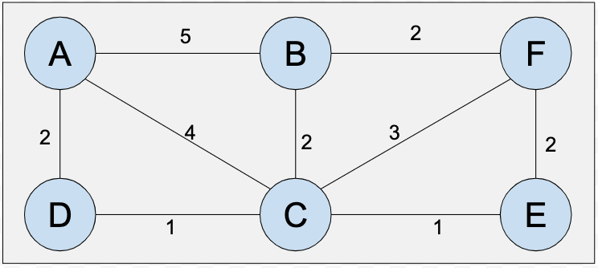
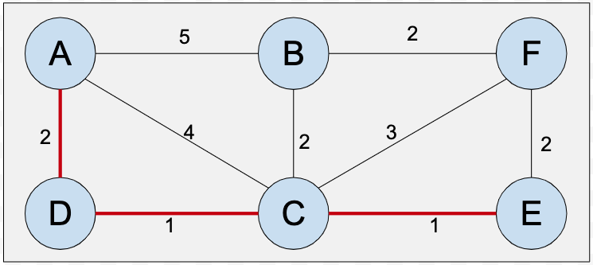
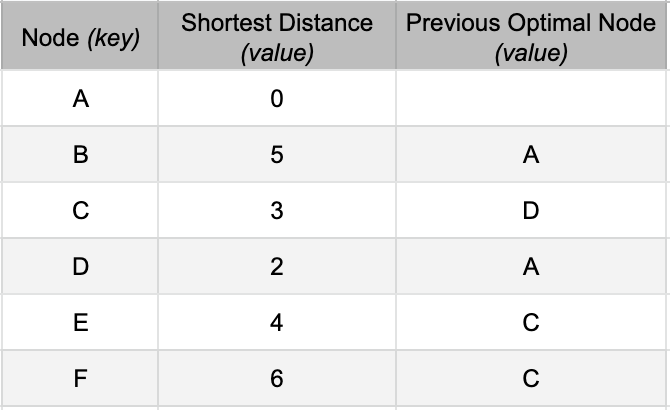

# AI PRojects
These are my implementations for each of the AI programming assignments.

## Dijkstra's Shortest Path Algorithm
Suppose there is graph having nodes, where each node represents a city. A few pair of nodes are connected to each other, with their distance mentioned on the conneting edge, as shown in the figure below:<br>
<br>

To find the shortest path from a given source to destination node in the example above, a Greedy approach would be - *At each current node, keep track of the nearest neighbour. We can determine the path in the reverse order once we have a table of nearest neighbours (optimal previous nodes).* For example, C is the optimal previous node for E. This way, the shortest path from `A` to `E` would be `A --> D --> C --> E`, as shown below:<br>
<br>

And, if we wish to print the distance of each node from `A`, then it would look like:<br>
<br>

Here, the **Previous Optimal Node** is the "best" node which could lead us to the current node. 

## The Problem
Using Dijkstra's algorithm, find the shortest path to all the nodes starting from a given single source node.  You need to print the distance of each node from the given source node. For the example quoted above, the distance of each node from `A` would be printed as:<br>
```
{'A': 0, 'D': 2, 'B': 5, 'E': 4, 'C': 3, 'F': 6}
```